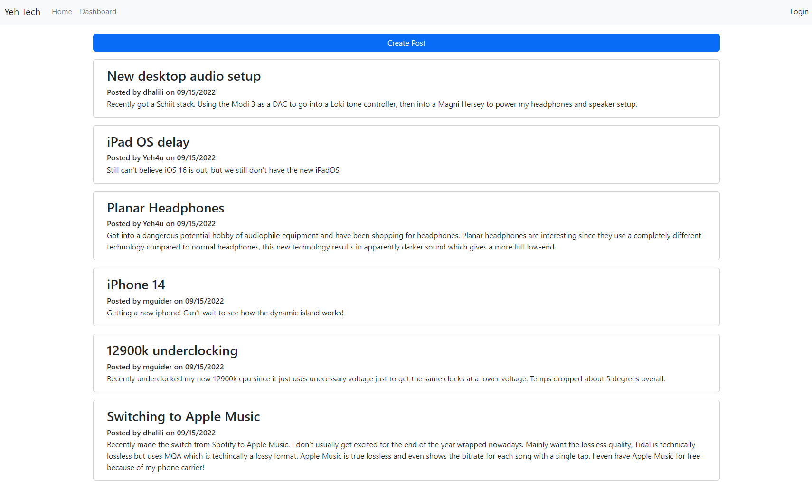

# Project Name - change to the name of your project

## Table of contents

- [Overview](#overview)
  - [The challenge](#the-challenge)
  - [User Story](#user-story)
  - [Acceptance Criteria](#acceptance-criteria)
  - [Screenshot](#screenshot)
  - [Links](#links)
- [My process](#my-process)
  - [Built with](#built-with)
  - [What I learned](#what-i-learned)
  - [Continued development](#continued-development)
  - [Useful resources](#useful-resources)
- [Author](#author)

## Overview

### The challenge

The challenge of this assignment is to create a tech blog site using Express for session handling, Sequelize and mySQL for database handling and Handlebars for templating.

### User Story

AS A developer who writes about tech  
I WANT a CMS-style blog site  
SO THAT I can publish articles, blog posts, and my thoughts and opinions

### Acceptance Criteria

GIVEN a CMS-style blog site  
WHEN I visit the site for the first time  
THEN I am presented with the homepage, which includes existing blog posts if any have been posted; navigation links for the homepage and the dashboard; and the option to log in  
WHEN I click on the homepage option  
THEN I am taken to the homepage  
WHEN I click on any other links in the navigation  
THEN I am prompted to either sign up or sign in  
WHEN I choose to sign up  
THEN I am prompted to create a username and password  
WHEN I click on the sign-up button  
THEN my user credentials are saved and I am logged into the site  
WHEN I revisit the site at a later time and choose to sign in  
THEN I am prompted to enter my username and password  
WHEN I am signed in to the site  
THEN I see navigation links for the homepage, the dashboard, and the option to log out  
WHEN I click on the homepage option in the navigation  
THEN I am taken to the homepage and presented with existing blog posts that include the post title and the date created  
WHEN I click on an existing blog post  
THEN I am presented with the post title, contents, post creator’s username, and date created for that post and have the option to leave a comment  
WHEN I enter a comment and click on the submit button while signed in  
THEN the comment is saved and the post is updated to display the comment, the comment creator’s username, and the date created  
WHEN I click on the dashboard option in the navigation  
THEN I am taken to the dashboard and presented with any blog posts I have already created and the option to add a new blog post  
WHEN I click on the button to add a new blog post  
THEN I am prompted to enter both a title and contents for my blog post  
WHEN I click on the button to create a new blog post  
THEN the title and contents of my post are saved and I am taken back to an updated dashboard with my new blog post  
WHEN I click on one of my existing posts in the dashboard  
THEN I am able to delete or update my post and taken back to an updated dashboard  
WHEN I click on the logout option in the navigation  
THEN I am signed out of the site  
WHEN I am idle on the site for more than a set time  
THEN I am able to view comments but I am prompted to log in again before I can add, update, or delete comments

### Screenshot



### Links

- Solution URL: [https://github.com/ayeh6/Yeh-Tech](https://github.com/ayeh6/Yeh-Tech)
- Live Site URL: [https://yeh-tech.herokuapp.com/](https://yeh-tech.herokuapp.com/)

## My process

### Built with

- HTML
- CSS
- Javascript
- Node
- Express
- Handlebars
- Bootstrap

### What I learned

One of the neat things I learned from this assignment is how helpers work with Handlebars. Handlebars is pretty bare in terms of functionality out of the box, so to create additional functionality, code is needed to be made to give more options and logic. Below is a bit of code I used to create a string matching statement.

```js
module.exports = {
   stringMatch: (string1, string2, options) => {
      return (string1 === string2) ? options.fn(this) : options.inverse(this);
   }
}
```

Basically checks if the two strings are equal and if so chooses which option is used based on the boolean output of the match. This was very helpful when checking which elements should be visible based on the logged in user.

### Continued development

As for continued development, I'd like to make this site more visually appealing and add a dark mode. Also probably more checks and better implementation of the response objects to give more understandable responses if something goes wrong instead of just sending "success" everytime it succeeds and nothings if it fails.

### Useful resources

- [StackOverflow](https://stackoverflow.com/questions/34252817/handlebarsjs-check-if-a-string-is-equal-to-a-value) - This stackoverflow question was very helpful in understanding how to create string matching logic into my views.

## Author

- Website - [Andrew Yeh](https://ayeh6.github.io/Yeh-Andrew-Portfolio-Website/)
- LinkedIn - [/in/ayeh6](https://www.linkedin.com/in/ayeh6/)
